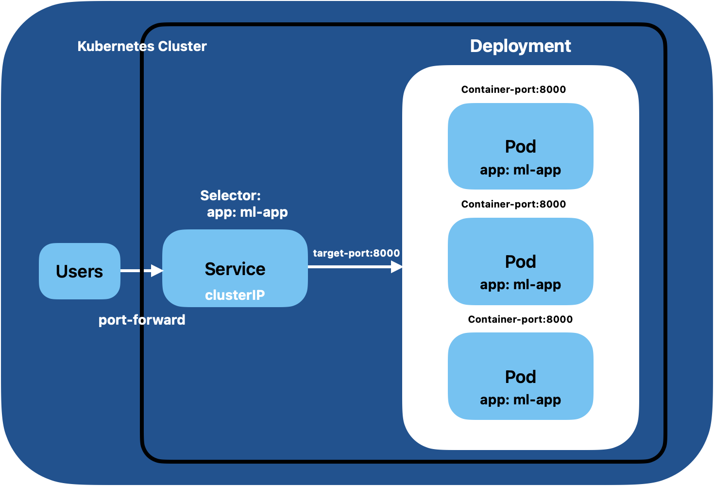

## Deploy the Dockerized FastAPI In Kubernetes Cluster

What we have covered till date?

1. Setting up Minikube + Kubernetes Cluster In Mac
2. Build a ML model and Serve it using FastAPI, and Containerize the app.

Today, we deploy the containerized application in Kubernetes Cluster.

Steps:

1. Run the Kubernetes Cluster using Minikube.
2. Understand and Create a app.yaml (containing deployment and service)
3. Deploy the app on Kubernetes Cluster

What happens when we run `kubectl apply -f app.yaml`

Two kubernetes resources are created Deployment and Services.

- Deployment is a controller which create and manages the pods.
- Service exposes the pods to the external world.

**Set up Flow**

**Commands**

`minikube start` — Starts a single-node Kubernetes cluster locally. This downloads the necessary images, starts the control plane (API server, scheduler, etcd) and the worker node (where your containers run).

`minikube push image ml-web-app:v1` — Pushes the docker image to minikube cluster

`kubectl apply -f app.yaml` — Takes your YAML configuration (which defines a Deployment and a Service) and sends it to the Kubernetes API server. The API server validates the configuration and instructs the cluster to create the specified resources.

`kubectl get pods` — After applying the YAML, this command lists the Pods running in your cluster. You should see two Pods, both in the `Running` state.

`kubectl get svc` — This lists the Services running in your cluster. You should see `web-app-service` listed with a `ClusterIP` (internal) IP address.

`kubectl get deployments` — This lists the Deployments in your cluster. You should see `web-app-deployment` with 2/2 replicas running.

`kubectl describe pod <pod-name>` — Use this to inspect the details of a specific Pod, including its events, container status, and configuration.

`kubectl describe svc web-app-service` — This shows detailed information about the Service, including the labels it selects and the endpoints (the IP:Port combinations of the Pods it routes traffic to).

`kubectl port-forward svc/web-app-service 8080:8000` — This forwards the traffic from port 8080 on your local machine to port 8000 on the service. You can then access the app at `http://localhost:8080`.

`kubectl delete -f app.yaml` — Use this to remove the resources created by your YAML file (both the Deployment and the Service).